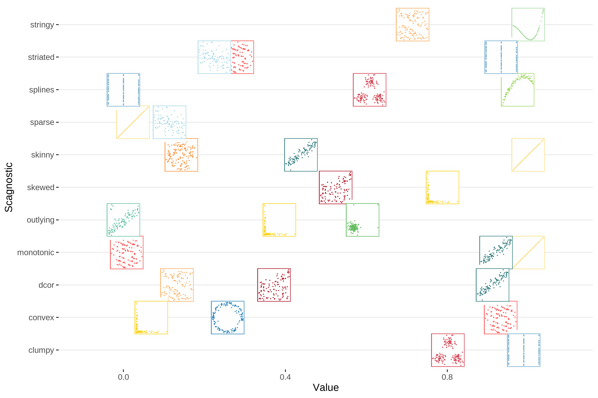

layout: false
class: split-75
background-image: url("plots/title_slide_bkg.png")
background-position: center
background-size: contain

<style type="text/css">
.remark-slide-content{
font-size: 34px;
line-height: 1.2;

}
code.r{
  font-size: 24px;
}

</style>

```{r setup, include=FALSE}
options(htmltools.dir.version = FALSE, width = 120)
library(tidyverse)
library(knitr)
library(kableExtra)
library(htmltools)
library(cassowaryr)
library(ggimg)
library(ggstance)
library(gridExtra)
library(plotly)
mypal <- c("#b2182b", "#d53e4f","#FF4E50", "#FC913A", "#fdae61",
           "#F9D423", "#fee08b" , "#abdda4" , "#a6d96a" , "#66c2a5" ,
           "#66bd63","#3B8183", "#3288bd", "#74add1",  "#abd9e9")
opts_chunk$set(
  echo = TRUE, warning = FALSE, message = FALSE, comment = "#>",
  fig.path = 'figure/', cache.path = 'cache/', fig.align = 'center',
  fig.width = 12, fig.height = 4, fig.show = 'hold',
  cache = FALSE, external = TRUE, dev = 'png', dev.args = list(bg = "transparent")
)
mp4_vid <- function(src, width){
  HTML(
    paste0(
      '<video width="', width, '" loop autoplay>
        <source src="', src, '" type="video/mp4">
      </video>'
    )
  )
}
```


```{css, echo=FALSE}
/* custom.css */
:root{
  --main-color1: #509e2f;
  --main-color2: #bcbddc;
  --main-color3: #efedf5;
  --main-color4: #9DDAE5;
  --text-color3: black;
  --text-color4: #505050;
  --code-inline-color: #4e5054;
  --link-color: #006CAB;
}
.large { font-size: 150% }
.largeish { font-size: 120% }
.summarystyle { font-size: 150%;
  line-height:150%;}
.my-gray {color: #606060!important; }
.tiny{ font-size: 25%}
```


.column[.content[


# **Scagnostics**

**with the cassowaryr package**

.my-gray[
.large[**Ursula Laa**]<br>
in collaboration with Harriet Mason, Stuart Lee and Di Cook

.largeish[ Institute of Statistics <br>
University of Natural Resources and Life Sciences
]
]

Austrian and Slovenian Statistical Days 2022

]]

.column[.top_abs.content[

]]

---

```{r, Features plot, echo = FALSE, fig.height=8, fig.width=12, out.width = "100%", fig.align='center'}
#plot them
ggplot(features, aes(x,y,colour=feature))+
  geom_point() +
  theme_minimal() +
  facet_wrap(~feature, ncol=5, scales="free") +
  xlab("") + ylab("") +
  theme(legend.position = "none",
        aspect.ratio= 1,
        axis.text = element_blank()) +
  scale_colour_manual(values = mypal)

```


---




---

# How are scagnostics defined?

Most scagnostics use the information from three graph objects and combine it to describe the shape

```{r, Example Data, include=FALSE, echo=FALSE, warning=FALSE}
example <- features %>% filter(feature=="ring") %>%
  select(x,y)
```

```{r, include=FALSE}
d1 <- draw_convexhull(example$x, example$y) +
  ggtitle("Convex hull") +
  xlab("") + ylab("") +
  theme_void() +
  theme(aspect.ratio=1, axis.text = element_blank())

d2 <- draw_alphahull(example$x, example$y) +
  ggtitle("Alpha hull") +
  xlab("") + ylab("") +
  theme_void() +
  theme(aspect.ratio=1, axis.text = element_blank())

d3 <- draw_mst(example$x, example$y) +
  ggtitle("Minimum Spanning Tree (MST)") +
  xlab("") + ylab("") +
  theme_void() +
  theme(aspect.ratio=1, axis.text = element_blank())
```

```{r, echo=FALSE, fig.align='left', fig.height=6, fig.width=14, warning=FALSE}
grid.arrange(d1,d2,d3, nrow=1)

```


---

**convex** 
--
**outlying** 

---
# History and implementations in R

Scagnostics were originally suggested by John Tukey (1982) and later advanced and implemented by Lee Wilkinson and collaborators (from ~2005)

- *scagnostics* package on CRAN: wrapper around the original implementation in Java, not straightforward to install/run, difficult to modify
- *binostics* package on GitHub: translated original code from Java to C, installation mostly straightforward, some C issues prevented submission to CRAN, difficult to modify
- *cassowaryr* package: new implementation, computes all the scagnostics in R, but relies on tripack (Fortran) for triangulation - might have to remove those dependencies before moving to CRAN

---
# The cassowaryr package

```{r echo=TRUE, eval=FALSE}
remotes::install_github("numbats/cassowaryr")
```

The two main functions are `cassowaryr::calc_scags` (one scatterplot) and `cassowaryr::calc_scags_wide` (all possible scatterplots).

```{r echo=TRUE}
calc_scags(anscombe$x1, anscombe$y1,
           scags = c("outlying", "convex", "splines"))
```

---
# Example: sports statistics

Consider data from the 2020 season of the Australian Football League Women's, obtained with the R package `fitzRoy`

- the data contains 68 variables, 33 of them are numeric
- this means there are 528 possible scatter plots we could look at
- use scagnostics to pick some interesting scatterplots

**Workflow:**

- compute scagnostics for all pairs of numeric variables
- interesting combinations should stand out in these measures $\rightarrow$ we look at a SPLOM of scagnostics measures
- select interesting combinations with interactive graphics


---
# Example: sports statistics

Illustrative example: select only the first few columns and compute three different scagnostics on all possible combinations.

```{r, include=FALSE}

load("aflw_num.rda")
aflw <- aflw_num
load("AFLW_scags.rda")

```

```{r}

calc_scags_wide(aflw[,2:5],
                scags = c("outlying", "skewed", "splines"))

```


---

# Example: sports statistics

```{r, AFLW Scatter Plots, echo=FALSE, fig.height=5, fig.width=9, out.width = "95%", fig.align='center'}

mypal <- c("#FF4E50", "#fdae61","#fee08b", "#66c2a5", "#3288bd", "#abd9e9")

#standounts from splom
#outlying and Skewed + highest skinny not 1
p1 <- ggplot(aflw_num, aes(x=disposalEfficiency, y=hitouts, label=Group.1)) +
  theme_classic()+
  ggtitle("Plot 1") +
  geom_point(colour=mypal[1])

#high on the 3 associations measures
p2 <- ggplot(aflw_num, aes(x=totalPossessions, y=disposals, label=Group.1)) +
  theme_classic()+
  ggtitle("Plot 2") +
  geom_point(colour=mypal[2])

#low on sparse and high on convex
p3 <- ggplot(aflw_num, aes(x=marksInside50, y=goals)) +
  theme_classic()+
  ggtitle("Plot 3") +
  geom_point(colour=mypal[3])

#high on clumpy adjusted, low on monotonic
p4 <- ggplot(aflw_num, aes(x=onePercenters, y=handballs)) +
  theme_classic()+
  ggtitle("Plot 4") +
  geom_point(colour=mypal[4])

#interesting HIGH on striated, moderate on outlying
p5 <- ggplot(aflw_num, aes(x=bounces, y=hitouts, label=Group.1)) +
  theme_classic()+
  ggtitle("Plot 5") +
  geom_point(colour=mypal[5])

# me randomly picking two variables
p6 <- ggplot(aflw_num, aes(x=kicks, y=handballs)) +
  theme_classic()+
  ggtitle("Plot 6") +
  geom_point(colour=mypal[6])

grid.arrange(p1, p2, p3, p4, p5, p6,  nrow=2)
```

---
# Example: sports statistics

```{r, Blue Scatter, echo=FALSE, fig.height=4, fig.width=8, out.width = "100%", fig.align='center'}

test <- AFLW_scags %>%
  mutate(lab = paste0(Var1, ", ", Var2)) %>%
  mutate(plot1=ifelse(lab=="disposalEfficiency, hitouts", TRUE,FALSE),
         plot2=ifelse(lab=="totalPossessions, disposals", TRUE,FALSE),
         plot3=ifelse(lab=="marksInside50, goals", TRUE,FALSE),
         plot4=ifelse(lab=="onePercenters, handballs", TRUE,FALSE),
         plot5=ifelse(lab=="hitouts, bounces", TRUE, FALSE)
         ) %>%
  mutate(plotted = any(plot1,plot2,plot3,plot4, plot5))

s5 <- ggplot(test, aes(x=outlying, y = striated_adjusted, colour=plot5, label=lab)) +
  geom_point() +
  theme_classic() +
  theme(legend.position ="none") +
  scale_colour_manual(values=c("grey", mypal[5])) +
  ggtitle("Relevant Scagnostics Plot")

grid.arrange(p5, s5, nrow=1)

```


---
# Current work and outlook

- Publish the package via CRAN (might need replacement for the `tripack` package)
- Improvements inside the package: implement different options for binning, new or improved measures
- Applications: use scagnostics to compare groups based on shape, maybe in combination with projection pursuit


```{r simdata, echo=FALSE}
# set seed
set.seed(2020)

# get L-shape data
lshape <- features %>% 
  filter(feature=="l-shape")

# make tibble group a
feature_vs_noise_A <- tibble(x1 = 2.5* cassowaryr:::unitize(lshape$x),
                           x2 = rnorm(100, 0.5, 1),
                           x3 = rnorm(100, 0.5, 1),
                           x4 = 2.5* cassowaryr:::unitize(lshape$y),
                           x5 = rnorm(100, 0.5, 1),
                           group = rep("A",100)
                           )

# Make tibble group b
feature_vs_noise_B <- tibble(x1 = rnorm(100, 0.5, 1),
                           x2 = rnorm(100, 0.5, 1),
                           x3 = rnorm(100, 0.5, 1),
                           x4 = rnorm(100, 0.5, 1),
                           x5 = rnorm(100, 0.5, 1),
                           group = rep("B",100)
                           )


# combine tibbles
feature_vs_noise <- bind_rows(feature_vs_noise_A, feature_vs_noise_B)
p1 <-  ggplot(feature_vs_noise, aes(x1, x4, color = group)) + geom_point(size = 3) +
    scale_color_brewer(type = "qual") +
  theme_void() + theme(legend.position = "none", aspect.ratio = 1)
p2 <-  ggplot(feature_vs_noise, aes(x2, x3, color = group)) + geom_point(size = 3) +
  scale_color_brewer(type = "qual") +
  theme_void() + theme(legend.position = "none", aspect.ratio = 1)
grid.arrange(p1, p2, nrow = 1)
```

---
layout: false
background-image: url("plots/title_slide_bkg.png")
background-position: center
background-size: contain

# Thanks!

<br>

This is joint work done in collaboration with **Harriet Mason**, **Stuart Lee** and **Di Cook**.


My slides are made using `RMarkdown`, `xaringan` and the `ninjutsu` theme.
The main `R` packages used are `cassowaryr`, `fitzRoy` and the `tidyverse`.
